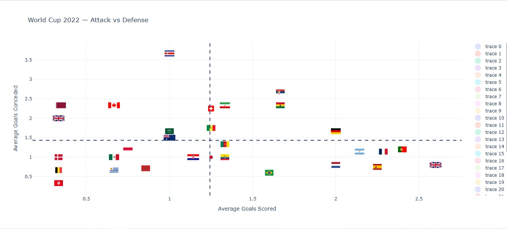
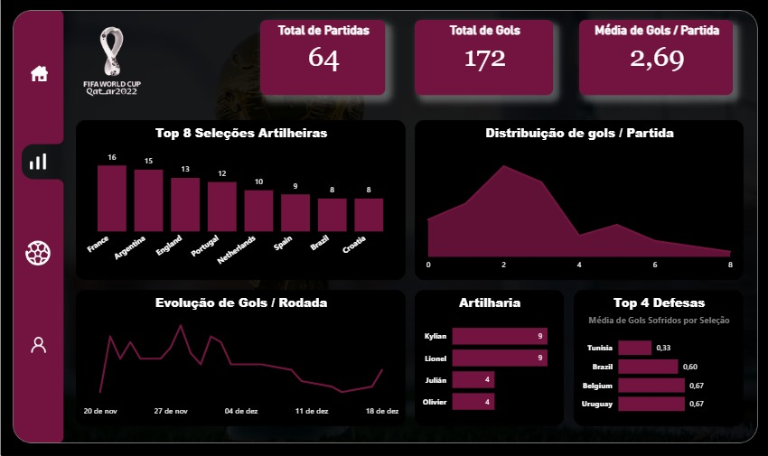

#  Análise de Dados — Copa do Mundo 2022

##  Visão Geral do Projeto

Este projeto realiza uma **análise de dados da Copa do Mundo de 2022**, explorando o desempenho das seleções nacionais utilizando dados das partidas.

Os dados foram extraídos utilizando a biblioteca **StatsBombPy** e processados com Python para gerar métricas ofensivas e defensivas das equipes.

O projeto inclui:

* Extração de dados das partidas
* Processamento e transformação de dados
* Visualização de dados
* Dashboard interativo
* Gráfico de dispersão comparando ataque vs defesa das seleções

---

## Ferramentas Utilizadas

* Python
* Pandas
* StatsBombPy
* Plotly
* Power BI

---

## 📂 Estrutura do Projeto

```
world-cup-2022-data-analysis

data/
    wc_matches.csv
    wc_scorers.csv
    wc_team_stats.csv

scripts/
    data_processing.py
    teamstats.py
    grafico_dispersao.py
    app.py

images/
    dashboard-copa.jpeg
    grafico_dispersao.jpeg
    world_cup_attack_defense.html
    

README.md
requirements.txt
```

---

## 📈 Análise de Dados

A análise explora diversas métricas importantes do torneio:

* Total de partidas
* Total de gols marcados
* Média de gols por jogo
* Artilheiros da competição
* Ranking das seleções
* Desempenho ofensivo e defensivo das equipes

Para cada seleção foram calculadas estatísticas como:

* Gols marcados
* Gols sofridos
* Média de gols marcados por jogo
* Média de gols sofridos por jogo

---

## 📊 Gráfico de Dispersão — Ataque vs Defesa

Foi criado um **gráfico de dispersão** comparando:

* Média de gols marcados
* Média de gols sofridos

Esse gráfico permite identificar:

* Seleções com ataque forte
* Seleções com defesa sólida
* Equipes equilibradas entre ataque e defesa
* Seleções com desempenho mais fraco

Cada seleção é representada pela **bandeira do país**, tornando a visualização mais intuitiva.

## 📊 Gráfico de Dispersão — Ataque vs Defesa




---

## 📉 Dashboard

Também foi desenvolvido um **dashboard interativo** com visualizações do torneio, incluindo:

* Total de partidas
* Total de gols
* Média de gols por jogo
* Ranking das seleções
* Distribuição de gols por partida
* Artilheiros da competição



---

## ⚙ Como Executar o Projeto

### Instalar dependências

```bash
pip install -r requirements.txt
```

---

## 📚 Fonte dos Dados

Os dados utilizados neste projeto foram obtidos a partir do **StatsBomb Open Data**, que disponibiliza dados públicos de partidas de futebol.

---

## 👨‍💻 Autor

Daniel Rozendo

Projeto de **Análise de Dados | Sports Analytics**
